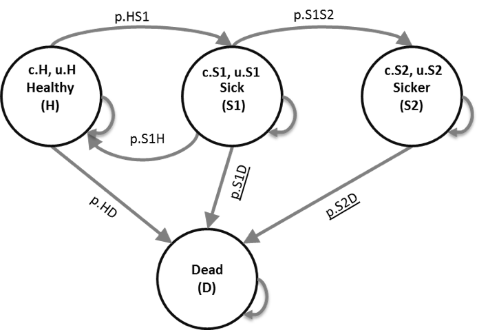

```{r setup, include=FALSE}
knitr::opts_chunk$set(echo = TRUE)

#doc.type <- knitr::opts_knit$get('rmarkdown.pandoc.to')
#opts_chunk$set(echo = FALSE, cache=FALSE)
```


```{r load_packages, include=FALSE}
library(knitr)
library(kableExtra) # https://haozhu233.github.io/kableExtra/awesome_table_in_html.html
library(dplyr)
library(reshape2)
library(ggplot2)
library(scales) # for dollar signs and commas
library(tensorA) # to use tensor algebra
```


```{r read chunks, include = FALSE}
# For some reason I can't manage reading these files so I copied it ot hte markdown for now but we need to see how we can source the files. 
#source("../R/01_model-inputs.R")
#source("../R/02_simulation-model.R")
#source("../R/03_calibration.R")
#source("../R/04_calculate-outcomes.R")
#source("../R/05a_deterministic-analysis.R")
#source("../R/05b_uncertainty-analysis.R")
#source("../R/06_value-of-information.R")
```


```{r,  echo = FALSE}
################################################################################ 
# This script generates all the required input parameters for the cohort       #
# implementation of the Sick-Sicker state-transition model (STM)               #
#                                                                              # 
# Depends on:                                                                  #
#   01_model-inputs-external_functions.R                                       #
#                                                                              # 
# Authors: Fernando Alarid-Escudero                                            # 
# E-mail: fernando.alarid@cide.edu                                             # 
################################################################################ 
# The structure of this code is according to the DARTH framework               #
# https://github.com/DARTH-git/Decision-Modeling-Framework                     #
################################################################################ 

# rm(list = ls()) # to clean the workspace

#### 01.1 Load packages and functions ####
#### 01.1.1 Load packages and functions ####
library(dplyr) # For data manipulation

#### 01.1.2 Load functions ####
source("../functions/01_model-inputs_functions.R")

#### 01.2 External parameters ####
#### 01.2.1 General setup ####
n.age.init  <- 25  # age of starting cohort
n.t         <- 75  # time horizon, number of cycles
v.age.names <- n.age.init:(n.age.init + n.t - 1) # vector with age names
v.n <- c("H", "S1", "S2", "D") # vector with the 4 health states of the model:
                               # Healthy (H), Sick (S1), Sicker (S2), Dead (D)
n.states <- length(v.n) # number of health states 
d.c <- 0.03 # discount rate for costs 
d.e <- 0.03 # discount rate for QALYs
v.dwc <- 1 / ((1 + d.e) ^ (0:(n.t))) # vector with discount weights for costs
v.dwe <- 1 / ((1 + d.c) ^ (0:(n.t))) # vector with discount weights for QALYs
v.s.init <- c(H = 1, S1 = 0, S2 = 0, D = 0) # initial state vector

#### 01.2.2 All-cause age-, sex- and race- (ASR) specific mortality ####
df.r.asr <- read.csv("../data/01_all-cause-mortality-USA-2015.csv")
v.r.asr  <- df.r.asr %>%
  dplyr::select(Total) %>%
  as.matrix()              # vector with mortality rates

#### 01.2.3 Generate initial set of base-case external parameters ####
v.params.init <- f.generate_init_params()
## Create name of parameters
v.names.params <- names(v.params.init)
## Save base-case set of parameters
write.csv(x = v.params.init, file = "../data/01_init-params.csv")

#### 01.3 Estimated parameters ####

```


In this document we showcase the framework via a fully functional decision model. In this case-study we perform a cost-effectiveness analysis (CEA) using a previously published 4-state model called the Sick-Sicker model.[@Enns2015] The model is used to quantify the expected costs and quality-adjusted life years (QALYs) for individuals with a hypothetical disease with two different stages, "Sick" and "Sicker". We calibrate the model using three targets, survival, prevalence and the proportion who are "Sick" among all those afflicted "Sick + Sicker". We then evaluate the cost-effectiveness of a hypothetical treatment that increases quality of life (QoL) in one of the disease states.[@Krijkamp2018] We identify the uncertainity around our decision based on the CEA using sensitivity analysis. Finaly, we perform a value of information (VoI) analysis to see if it is worth investing in extra research projects with the aim to eliminate the uncertainty around our decision. 

## The Sick-Sicker model 
In the Sick-Sicker model, we simulate a hypothetical cohort of `r n.age.init`-year-old individuals over a lifetime (or reaching age `r n.age.init + n.t` years old) using `r n.t` anual cycles, represented with `n.t`. The cohort start in the "Healthy" health state (denoted "H"). Healthy individuals are at risk of developing the illness, at which point they would transition to the first stage of the disease (the "Sick" health state, denoted "S1"). Individuals that become sick incur a one-time utility decrement of `r v.params.init$du.HS1` (`du.HS1`, disutility of transitioning from H to S1) and a one-time cost of \$`r v.params.init$ic.HS1` (`ic.HS1`) that reflect the acute impacts of developing the illness. Sick individuals are at risk of further progressing to a more severe stage (the "Sicker" health state, denoted "S2"), which is constant in this case example. There is a chance that individuals in the Sick state eventually recover and return back to the Healthy state. However, once an individual reaches the Sicker health state, they cannot recover; that is, the probability of transitioning to the Sick or Healthy health states from the Sicker health state is zero. Individuals in the Healthy state face background mortality that is age-specific (i.e., time-dependent). Sick and Sicker individuals face an increased mortality in the form of a hazard rate ratio (HR) of 3 and 10 times, respectively, on the background mortality rate. Sick and Sicker individuals also experience increased health care costs and reduced QoL compared to healthy individuals. Once simulated individuals die, they transition to the "Dead" health state (denoted "D"), where they remain. When an individual dies, they incur a one-time cost of \$`r v.params.init$ic.D` (`ic.D`) that reflects the acute care that might be received immediately preceding death. The state-transition diagram of the Sick-Sicker model is shown in Figure \ref{fig:STM Sick-Sicker}. The evolution of the cohort is simulated in one-year discrete-time cycles. Both costs and QALYs are discounted at an annual rate of `r d.e`%.




A hypothetical disease affects individuals with an average age of `r n.age.init` years and results in increased mortality, increased treatment costs and reduced quality of life. The disease has two levels; affected individuals initially become sick but can subsequently progress and become sicker. Two alternative strategies exist for this hypothetical disease: a no-treatment and a treatment strategy. Under the treatment strategy, individuals who become sick or progress and become sicker receive treatment and continue doing so until they recover or die. The cost of the treatment is additional to the cost of being sick or sicker for one year. The treatment improves quality of life for those individuals who are sick but has no effect on the quality of life of those who are sicker. You are asked to evaluate the cost-effectiveness of the treatment assuming a willingness to pay of \$80000.

To model this disease, we will rely on a state-transition cohort model, called the Sick-Sicker model, first described by Enns et al. The Sick-Sicker model consists of four health states: healthy (H), two disease states sick (S1) and sicker (S2) and dead (D) (Figure \ref{fig:STM Sick-Sicker}). All individuals start in the healthy state. Over time, healthy individuals may develop the disease and can progress to S1. Individuals in S1 can recover (return to state H), progress further to S2 or die. Individuals in S2 cannot recover (i.e. cannot transition to either S1 or H). Individuals in H are assumed to have a fixed mortality rate and individuals in S1 and S2 have an increased mortality rate compared to healthy individuals. These rates are used to calculate the probabilities to die when in S1 and S2. 


###01 Define model inputs 
The input for the Sick-Sicker model is informed by external data. All model parameter values and R variable names, for both the general set up and the external data, are presented in Table \ref{tab:parameters}. This tabel is informed via the files `01_Model-inputs_function.R`, that generates the base-case parameter set including these external values from the `01_basecase-params.csv` dataset and the `01_model-inputs.R`. The age specific mortality rated are derived from the Human Mortality data base and include the all cause mortality ratae fro the USA population based on 2015 data. This information is stored in the `01_all-cause-mortality-USA-2015.csv` file. 


Table: \label{tab:parameters} Description of parameters with their R name and value.

|           **Parameter**            |  **R name** |   **Value**   |
|:-----------------------------------|:-----------:|:-------------:|
| Time horizon ($n_t$)               | `n.t`       | `r n.t` years |
| Names of health states ($n$)       | `v.n`       | H, S1, S2, D  |
| Annual discount rate (costs/QALYs) | `d.c`/`d.e` |  3%           |
| Annual transition probabilities    |             |               |
| - Disease onset (H to S1)          | `p.HS1`     |  `r v.params.init$p.HS1`         |
| - Recovery (S1 to H)               | `p.S1H`     |  `r v.params.init$p.S1H`          |
| - Disease progression (S1 to S2)  in the time-homogenous model   | `p.S1S2`    |  `r v.params.init$p.S1S2`        |
| Annual mortality                   |             |               |
| - All-cause mortality (H to D)     | `p.HD`      |  age-specific |
| - Hazard ratio of death in S1 vs H | `hr.S1`     |  `r v.params.init$hr.S1`            |
| - Hazard ratio of death in S2 vs H | `hr.S2`     |  `r v.params.init$hr.S1`           |
| Annual costs                       |             |               |
| - Healthy individuals              | `c.H`       |  $2,000       |
| - Sick individuals in S1           | `c.S1`      |  $4,000       |
| - Sick individuals in S2           | `c.S2`      |  $15,000      |
| - Dead individuals                 | `c.D`       |  $0           |
| - Additional costs of sick individuals treated in S1 or S2           | `c.Trt`     |  $12,000      |
| Utility weights                    |             |               |
| - Healthy individuals              | `u.H`       |  1.00         |
| - Sick individuals in S1           | `u.S1`      |  0.75         |
| - Sick individuals in S2           | `u.S2`      |  0.50         |
| - Dead individuals                 | `u.D`       |  0.00         |
| Intervention effect                |             |               |
| - Utility for treated individuals in S1 | `u.Trt` |  0.95        |
| Transition rewards                 |             |               |
| - Utility decrement of healthy individuals | `du.HS1`|  0.01       |
|   when transitioning to S1         |             |               |
| - Cost of healthy individuals      | `ic.HS1` |  $1,000       |
|   when transitioning to S1         |             |               |
| - Cost of dying                    | `ic.D`      |  $2,000       |


###02 Model implementation 
```{r, eval = TRUE, echo = FALSE}
################################################################################ 
# This script runs the cohort implementation of the Sick-Sicker                #
# state-transition model (STM)                                                 #
#                                                                              # 
# Depends on:                                                                  #
#   01_model-inputs.R                                                          #
#   02_simulation-model_functions.R                                            #
#                                                                              # 
# Author: Fernando Alarid-Escudero                                             # 
# E-mail: fernando.alarid@cide.edu                                             # 
################################################################################ 
# The structure of this code is according to the DARTH framework               #
# https://github.com/DARTH-git/Decision-Modeling-Framework                     #
################################################################################ 

# rm(list = ls()) # to clean the workspace

#### 02.1 Load packages and functions ####
#### 02.1.1 Load packages and functions ####
library(dplyr) # For data manipulation

#### 02.1.2 Load inputs ####
#source("../R/01_model-inputs.R")

#### 02.1.3 Load functions ####
source("../functions/02_simulation-model_functions.R")

#### 02.2 Run STM ####
### Create list of model output
l.out.stm <- f.decision_model(v.params = v.params.init)
```
In order to be able to run a state-transition cohort model a transition probability matrix needs to be created. This matrix contains the probabilities of transitioning from the current health state, indicated by the rows, towards the new health states, specified in the columns. More information about creating these matrices is described in a paper about State-transition models using R [@Alarid-Escudero2018]. 

To incorporate the age specific mortality for healthy individuals we calculate a transition probability matrix for every cycle. The matrices for all cycles are collected in a structure called array `a.P`. Using indexing, when running the model, we can use the transition probability matrix corresponding with the current age of the cohort. 

The transition probability matrix for the first cycles shows the transition probabilities at the first cycles. 
```{r, eval = TRUE, echo = TRUE}
l.out.stm$a.P[, , 1] # transition probability matrix for the first three cycles
```

Comparing the matrix for the last cycle, `n.t` with the one above from cycle 1 shows you the increased probabilities of transitioning to death form all health states. 
```{r, eval = TRUE, echo = TRUE}
l.out.stm$a.P[, , n.t] # transition probability matrix for the first three cycles
```

By running the `02_simulation-model.R` file we generate the cohort trace describing how the cohort is distributed among the different health states over time. This is show in Figure \ref{fig:Sick-Sicker-Trace}.

```{r Sick-Sicker-Trace, echo=FALSE, fig.cap='\\label{fig:Sick-Sicker-Trace}Cohort trace of the Sick-Sicker cohort model', message=FALSE, warning=FALSE, fig.pos="H"} 
ggplot(melt(l.out.stm$m.M), aes(x = Var1, y = value, color = Var2, linetype = Var2)) +
  geom_line(size = 1.3) +
  scale_color_discrete(l = 50, name = "Health state") +
  scale_linetype_discrete(name = "Health state") +
  xlab("Cycle") +
  ylab("Proportion of the cohort") +
  theme_bw(base_size = 16) +
  theme()
# matplot(m.M, pch = v.n)
```


###03 Model calibration 
We calibrated the Sick-Sicker model using a Bayesian approach using the incremental mixture importance sampling (IMIS) algorithm [Teele2006], which has been used to calibrate health policy models [Raftery2010, @Menzies2017, Rutter2018]. Bayesian methods allow us to quantify the uncertainty in the calibrated parameters even in the presence of non-identifiability [@Alarid-Escudero2018b]. We assumed a normal likelihood and uniform priors. For a more detailed description of IMIS for Bayesian calibration, different likelihood functions and prior distributions, we refer the reader to the tutorial for Bayesian calibration by Menzies et al. [@Menzies2017]. For illustration purposes, we also calibrated the Sick-Sicker model with the Nelder-Mead algorithm [@Nelder1965], which was initialized at 100 different starting points sampled from the prior distributions of the calibrated parameters. This calibration exercise can be found in the file `app2_calibration-nelder-mead.R`.

We have external data for the calibration of three parameters from the Sick-Sicker model. This data, stored in the `03_calibration-tarted.RData` file, contains information about survival, the disease prevalence and the proportion who are sick among those afflicted (sick and sicker). The `03_calibration_functions.R` file contains two functions for the calibration proces. One to generate model outputs for calibraion from a parameters set called `f.calibration_out` and a Goodness of fit function for calibration from a parameter set called `f.gof`.

```{r, eval = TRUE, echo = FALSE, warning = FALSE, message = FALSE}
################################################################################ 
# This script calibrates the Sick-Sicker state-transition model (STM) to       #
# epidemiological targets                                                      #
#                                                                              # 
# Depends on:                                                                  #
#   01_model-inputs.R                                                          #
#   02_simulation-model_functions.R                                            #
#   02_calibration_functions.R                                                 #
#                                                                              # 
# Author: Fernando Alarid-Escudero                                             # 
# E-mail: fernando.alarid@cide.edu                                             # 
################################################################################ 
# The structure of this code is according to the DARTH framework               #
# https://github.com/DARTH-git/Decision-Modeling-Framework                     #
################################################################################ 
# rm(list = ls()) # to clean the workspace

#### 03.1 Load packages and functions ####
#### 03.1.1 Load packages and functions ####
# Calibration functionality
library(lhs) # latin hypercube sampling

# Visualization
library(plotrix)       # plots with lower and upper error bands
library(psych)         # pairwise histograms
library(scatterplot3d) # 3D scatterplots

#### 03.1.2 Load inputs ####
#source("R/01_model-inputs.R")

#### 03.1.3 Load functions ####
#source("functions/02_simulation-model_functions.R")
source("../functions/03_calibration_functions.R")

#### 03.1.4 Load calibration targets ####
load("../data/03_calibration-targets.RData")

#### 03.2 Visualize targets ####
## TARGET 1: Survival ("Surv")
#plotrix::plotCI(x = SickSicker.targets$Surv$Time, y = #SickSicker.targets$Surv$value, 
#                ui = SickSicker.targets$Surv$ub,
#                li = SickSicker.targets$Surv$lb,
#                ylim = c(0, 1), 
#                xlab = "Time", ylab = "Pr(Alive)")
#
## TARGET 2: Prevalence ("Prev")
#plotrix::plotCI(x = SickSicker.targets$Prev$Time, y = #SickSicker.targets$Prev$value, 
#                ui = SickSicker.targets$Prev$ub,
#                li = SickSicker.targets$Prev$lb,
#                ylim = c(0, 1), 
#                xlab = "Time", ylab = "Pr(Sick+Sicker)")
#
## TARGET 3: Proportion who are Sick ("PropSick"), among all those afflicted #(Sick+Sicker)
#plotrix::plotCI(x = SickSicker.targets$PropSick$Time, y = #SickSicker.targets$PropSick$value, 
#                ui = SickSicker.targets$PropSick$ub,
#                li = SickSicker.targets$PropSick$lb,
#                ylim = c(0, 1), 
#                xlab = "Time", ylab = "Pr(Sick | Sick+Sicker)")
```

In the first section of the calibration we load the data, we visualize our targets and we check if the calibration function runs by using the default values of the parameters of interest. In the section 03.3.3 we run the Nelder-Mead for each starting point and we explore the best fitting input sets. The best set of parameters from the Nelder-Mead is saved in the file `03_nm-best-set.RData`.


```{r, eval = TRUE, echo = FALSE, warning = FALSE, message = FALSE}
#### 03.3 Run calibration algorithms ####
# Check that it works
v.params.calib = c(p.S1S2 = 0.105, hr.S1 = 3, hr.S2 = 10)
f.calibration_out(v.params.calib = v.params.calib)

#### 03.3.1 Specify calibration parameters ####
# Specify seed (for reproducible sequence of random numbers)
set.seed(072218)

# number of initial starting points
n.init <- 100

# names and number of input parameters to be calibrated
v.param.names <- c("p.S1S2", "hr.S1", "hr.S2")
n.param       <- length(v.param.names)

# vector with range on input search space
v.lb <- c(p.S1S2 = 0.01, hr.S1 = 1.0, hr.S2 = 5)  # lower bound
v.ub <- c(p.S1S2 = 0.50, hr.S1 = 4.5, hr.S2 = 15) # upper bound

# number of calibration targets
v.target.names <- c("Surv", "Prev", "PropSick")
n.target       <- length(v.target.names)

#### 03.3.2 Sample multiple random starting values for Nelder-Mead ####
# Sample unit Latin Hypercube
m.lhs.unit <- randomLHS(n.init, n.param)

# Rescale to min/max of each parameter
m.params.init <- matrix(nrow = n.init, ncol = n.param)
for (i in 1:n.param){
  m.params.init[, i] = qunif(m.lhs.unit[, i],
                            min = v.lb[i],
                            max = v.ub[i])
}
colnames(m.params.init) <- v.param.names

# Visualize sample of starting points
psych::pairs.panels(m.params.init)

#### 03.3.3 Run Nelder-Mead for each starting point ####
m.calib.res <- matrix(nrow = n.init, ncol = n.param + 1)
colnames(m.calib.res) = c(v.param.names, "Overall_fit")

for (j in 1:n.init){
  # Run NM
  fit.nm <- optim(m.params.init[j, ], f.gof, 
                  control = list(fnscale = -1, # fnscale = -1 switches from minimization to maximization
                                 maxit = 1000), 
                  hessian = T)
  # Store caibrated parameters and GOF value at last NM iteration
  m.calib.res[j, ] <- c(fit.nm$par, fit.nm$value)
}

#### 03.4 Exploring best-fitting input sets ####
# Arrange parameter sets in order of fit
m.calib.res <- m.calib.res[order(-m.calib.res[, "Overall_fit"]),]

# Examine the top 10 best-fitting sets
m.calib.res[1:10, ]
# Plot the top 10 (top 10%)
#scatterplot3d(x = m.calib.res[1:10, 1],
#              y = m.calib.res[1:10, 2],
#              z = m.calib.res[1:10, 3],
#              xlim = c(v.lb[1], v.ub[1]), 
#              ylim = c(v.lb[2], v.ub[2]), 
#              zlim = c(v.lb[3], v.ub[3]),
#              xlab = v.param.names[1], 
#              ylab = v.param.names[2], 
#              zlab = v.param.names[3])
#
#### 03.4.1 Store best parameter set from NM calibration ####
v.params.calib.best <- m.calib.res[1, -4]
#save(v.params.calib.best, file = "data/03_nm-best-set.RData")
```

The last part of the calibration includes initernal validation of the values predicted by the model using the best set of parameters and our targets. 

```{r, eval = TRUE, echo = FALSE, warning = FALSE, message = FALSE}
#### 03.5 Internal validation: Model-predicted ouput at best set vs. targets ####
l.out.calib <- f.calibration_out(m.calib.res[1, ])

# TARGET 1: Survival ("Surv")
plotrix::plotCI(x = SickSicker.targets$Surv$Time, y = SickSicker.targets$Surv$value, 
                ui = SickSicker.targets$Surv$ub,
                li = SickSicker.targets$Surv$lb,
                ylim = c(0, 1), 
                xlab = "Time", ylab = "Pr(Alive)")
points(x = SickSicker.targets$Surv$Time, 
       y = l.out.calib$Surv, 
       pch = 8, col = "red")
legend("bottomright", 
       legend = c("Target", "Model-predicted output"),
       col = c("black", "red"), pch = c(1, 8))

# TARGET 2: Prevalence ("Prev")
plotrix::plotCI(x = SickSicker.targets$Prev$Time, y = SickSicker.targets$Prev$value, 
                ui = SickSicker.targets$Prev$ub,
                li = SickSicker.targets$Prev$lb,
                ylim = c(0, 1), 
                xlab = "Time", ylab = "Pr(Sick+Sicker)")
points(x = SickSicker.targets$Prev$Time, 
       y = l.out.calib$Prev, 
       pch = 8, col = "red")
legend("bottomright", 
       legend = c("Target", "Model-predicted output"),
       col = c("black", "red"), pch = c(1, 8))

# TARGET 3: Proportion who are Sick ("PropSick"), among all those afflicted (Sick+Sicker)
plotrix::plotCI(x = SickSicker.targets$PropSick$Time, y = SickSicker.targets$PropSick$value, 
                ui = SickSicker.targets$PropSick$ub,
                li = SickSicker.targets$PropSick$lb,
                ylim = c(0, 1), 
                xlab = "Time", ylab = "Pr(Sick | Sick+Sicker)")
points(x = SickSicker.targets$PropSick$Time, 
       y = l.out.calib$PropSick, 
       pch = 8, col = "red")
legend("bottomleft", 
       legend = c("Target", "Model-predicted output"),
       col = c("black", "red"), pch = c(1, 8))
```

The figures show that our best-set of parameters is quite good, since the model-redicted output is very close ot our targets. 

###04 Calculate model outcome
```{r}

```


The generated cost-effectiveness inputs, decision model implementation data and calibrated parameters from the Sick-Sicker model are combined in this part. The `04_functions` file creates a base-case parameter set used to inform the transition probability matrix for the CEA analysis from the calibrated parameters. The `f.calculate_ce_out` is the core part of the model and generates the CE outcome. 

Each health state in the model is associated with a specific utility and a cost. The cost of the treatment is additional to the cost of being sick or sicker for one year. The treatment improves quality of life for those individuals who are sick but has no effect on the quality of life of those who are sicker. 

 
The interventions differ from each other in costs and rewards. The utility of the health states decreased with severity of the state. 
The interventions differ from each other in cose. Treatment increases cost and is reducing qualo
Unless the transition probabilities, the cost and effectiveness are 

increased treatment costs and reduced quality of life.


Running the model to generate output is a very important part of the modeling process. This part of the process however, is code wise very simple. This file is informed by the generated inputs and decision model implementation. The function used is the function for an iterative loop for time, the total number of cycles the model needs to run, multiplies the transition probability matrix for the current cycle with the allocation of the cohort at that cycle. This multiplication calculated how the cohort is allocated among the health state at the next cycle. So this iterative process fills the Markov trace. Since the transition probabilities differ between the treatment strategy and the no treatment strategy within the iterative process this calculation is done for both the strategies.  

### Sensitivity analysis 
To quantify the uncertainty of our decision based on the cost-effectiveness analysis of the Sick-Sicker model both deterministic and probabilistic sensitivity analysis are performed. We start with the deterministic analysis performed using the `05a_deterministic-analysis.R` file followed bu the uncertainity analysis code in `05b_uncertainty-analsyis.R`. 

####05a Deterministic analysis of Decision analysis / cost-effectiveness analysis 
The deterministic sensitivity analysis of the Sick-Sicker model consists of a one-way sensitivity analysis looking at the effect of the utility value used for Sicker (S2) on the QALY, the outcome of interest. 

####05b Uncertainty analyses of  Decision analysis / cost-effectiveness analysis


###06 Value of information


### References 

