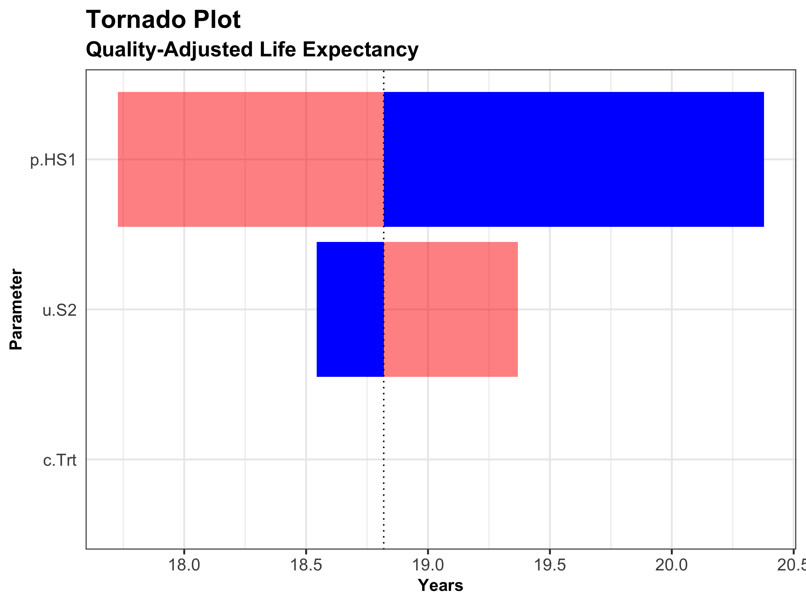

```{r setup, include=FALSE}
knitr::opts_chunk$set(echo = TRUE)
# Set working directory via relative path to root from Rmd
# to avoid issue with the Markdown 
# http://pbahr.github.io/tips/2016/04/16/fix_rmarkdown_working_directory_issue
knitr::opts_knit$set(root.dir = '~/Dropbox (Persoonlijk)/03_Onderzoek/DARTH framework/Decision-Modeling-Framework')
```


```{r load_packages, include=FALSE}
library(knitr)
# https://haozhu233.github.io/kableExtra/awesome_table_in_html.html
library(kableExtra) 
library(dplyr)
library(reshape2)
library(ggplot2)
library(scales) # for dollar signs and commas
library(tensorA) # to use tensor algebra
```

```{r read chunks, include = FALSE}
source("R/01_model-inputs.R")
source("R/02_simulation-model.R")
source("R/03_calibration.R")
source("R/04_validation.R")
#source("R/05a_deterministic-analysis.R")
#source("R/05b_uncertainty-analysis.R")
```

## How to read this document
This document is meant to showcase our framework via a fully functional decision model. In this case-study we perform a cost-effectiveness analysis (CEA) using a previously published 4-state model called the Sick-Sicker model.[@Enns2015] This document is supportive material to the 'A need for change! A coding framework for improving transparency in decision modeling' paper from the DARTH workgroup, and you are therefore recommended to first read this paper before you read this document.

We start this document by explaining the case example we use, followed by expalining all the different components as described in the paper. As explained in the paper, uur file organization consist of several folder. This markdown manuscript can be found in the manuscript folder. Our figures can be found in the figure folder and when we talk about functions we use you can find them in the *functions* folder. All other `R` files can be found in the `R` script folder.


## The Sick-Sicker model 
In the Sick-Sicker model, a hypothetical disease affects individuals with an average age of `r n.age.init` years and results in increased mortality, increased treatment costs and reduced quality of life. We simulate a hypothetical cohort of `r n.age.init`-year-old individuals over a lifetime (or reaching age `r n.age.init + n.t` years old) using `r n.t` annual cycles, represented with `n.t`. The cohort start in the "Healthy" health state (denoted "H"). Healthy individuals are at risk of developing the illness, at which point they would transition to the first stage of the disease (the "Sick" health state, denoted "S1"). Sick individuals are at risk of further progressing to a more severe stage (the "Sicker" health state, denoted "S2"), which is constant in this case example. There is a chance that individuals in the Sick state eventually recover and return back to the Healthy healthy state. However, once an individual reaches the Sicker health state, they cannot recover; that is, the probability of transitioning to the Sick or Healthy health states from the Sicker health state is zero. Individuals in the Healthy state face background mortality that is age-specific (i.e., time-dependent). Sick and Sicker individuals face an increased mortality in the form of a hazard rate ratio (HR) of 3 and 10 times, respectively, on the background mortality rate. Sick and Sicker individuals also experience increased health care costs and reduced QoL compared to healthy individuals. Once simulated individuals die, they transition to the "Dead" health state (denoted "D"), where they remain. Figure \ref{fig:STM Sick-Sicker} shows the state-transition diagram of the Sick-Sicker model. The evolution of the cohort is simulated in one-year discrete-time cycles. Both costs and QALYs are discounted at an annual rate of `r d.e` %. 


Two alternative strategies exist for this hypothetical disease: a no-treatment and a treatment strategy. Under the treatment strategy, Sick and Sicker individuals receive treatment and continue doing so until they recover or die. The cost of the treatment is additional to the cost of being Sick or Sicker for one year. The treatment improves QoL for those individuals who are Sick but has no effect on the QoL of those who are sicker. 

We are asked to evaluate the cost-effectiveness of this treatment that increases QoL in one of the disease states assuming as willingness to pay of $8000.[@Krijkamp2018] We also identify the uncertainty around our decision based on the CEA using sensitivity analysis. We end the showcase of our framework by performing a value of information (VoI) analysis to see if it is worth investing in extra research projects with the aim to reduce the uncertainty around our decision. All steps of the cost-effectiveness analysis will be described using the different components of the framework. 

###01 Define model inputs
As described in the paper, in this component we declare all model input variables and set their values. The `R` script running all components of this section is the `01_model-inputs.R` file in the `R` script folder. 

The input to inform the values is categorized in three categories: external, estimated, and calibrated. The majority of the Sick-Sicker model parameters are informed by external data, while only three parameter values need to be estimated using model calibration. 

In this component we start with the general setup of the model,specifying among others the time horizon, prevalence of the different health states at the start of the model and discount rates. The next step is to declare and inform the external parameter. The model parameter values and `R` variable names are presented in Table \ref{tab:parameters}. 

Table: \label{tab:parameters} Description of parameters with their `R` name and value.

|           **Parameter**            |  **R name** |   **Value**   |
|:-----------------------------------|:-----------:|:-------------:|
| Time horizon ($n_t$)               | `n.t`       | `r n.t` years |
| Names of health states ($n$)       | `v.n`       | H, S1, S2, D  |
| Annual discount rate (costs/QALYs) | `d.c`/`d.e` |  3%           |
| Annual transition probabilities    |             |               |
| - Disease onset (H to S1)          | `p.HS1`     |  `r df.params.init$p.HS1`         |
| - Recovery (S1 to H)               | `p.S1H`     |  `r df.params.init$p.S1H`          |
| - Disease progression (S1 to S2)  in the time-homogenous model   | `p.S1S2`    |  `r df.params.init$p.S1S2`        |
| Annual mortality                   |             |               |
| - All-cause mortality (H to D)     | `p.HD`      |  age-specific |
| - Hazard ratio of death in S1 vs H | `hr.S1`     |  `r df.params.init$hr.S1`            |
| - Hazard ratio of death in S2 vs H | `hr.S2`     |  `r df.params.init$hr.S1`           |
| Annual costs                       |             |               |
| - Healthy individuals              | `c.H`       |  $2,000       |
| - Sick individuals in S1           | `c.S1`      |  $4,000       |
| - Sick individuals in S2           | `c.S2`      |  $15,000      |
| - Dead individuals                 | `c.D`       |  $0           |
| - Additional costs of sick individuals treated in S1 or S2           | `c.Trt`     |  $12,000      |
| Utility weights                    |             |               |
| - Healthy individuals              | `u.H`       |  1.00         |
| - Sick individuals in S1           | `u.S1`      |  0.75         |
| - Sick individuals in S2           | `u.S2`      |  0.50         |
| - Dead individuals                 | `u.D`       |  0.00         |
| Intervention effect                |             |               |
| - Utility for treated individuals in S1 | `u.Trt` |  0.95        |

The all-cause mortality of healthy individuals is age specific. We therefore load the `01_all-cause-mortality-USA-2015.csv` file, including the age-, sex- and race- (ASR) specific mortality rates for the US population in 2015 derived from the Human Mortality database.

The other external parameter values are all stored the 01_init-params.csv file in the data folder. Based on this file a base-case parameters set, an `R` data frame, of this information is generated by the `f.generate_init_params()` function. Using a function to create a basecase parameters dataframe might see complex, but it is important for the sensitivity analysis we will do in component 5 of the framework. 

```{r}
print.function(f.define_init_params) # print the code of the function
```

In this code you can see that the functions start calling the .csv file and stores the values of the paramers. All of this is combined in a dataframe. The Sick-Sicker model does not have estimated paramters, but there are three parameters that need to be estimated vai model calibration. In this stage of theframework, we simply set these parameters to valid “dummy” values that are compatible with the next phase of the analysis, model implementation, but are ultimately just placeholder values until we conduct the calibration phase. This means that these values will be replaced by the best-fitted calibrated values after we performed the calibration. 


###02 Model implementation

The `R` script running all components of this section is the `02_simulation-model.R` file in the `R` script folder. 

In order to be able to run a state-transition cohort model a transition probability matrix needs to be created. This matrix contains the probabilities of transitioning from the current health state, indicated by the rows, towards the new health states, specified in the columns. More information about creating these matrices is described in a paper about State-transition models using R [@Alarid-Escudero2018]. 

The `02_simulation-model_functions.R` file in the functions folder creates a functions called `f.decision_model` that is able to generate this transition probability matrix for every cycle. Using indexing, when running the model, we can use the transition probability matrix corresponding with the current age of the cohort. 

```{r}
print.function(f.decision_model) # print the code of the function
```
To incorporate the age specific mortality for healthy individuals the function calculates a transition probability matrix for every cycle. All these cycle specifyc matrixed are collected in a structure called array `a.P`. The functions include some code to check if both the transition probabilities them self, as well as the transition probability matrices are valid.  

The transition probability matrix for the first cycles shows the transition probabilities at the first cycles. 
```{r, eval = TRUE, echo = TRUE}
l.out.stm$a.P[, , 1] # transition probability matrix for the first cycles
```

Comparing the matrix for the last cycle, `n.t` with the one above from cycle 1 shows you the increased probabilities of transitioning to death form all health states. 
```{r, eval = TRUE, echo = TRUE}
l.out.stm$a.P[, , n.t] # transition probability matrix for the last cycle
```

The second part of the `f.decision_model` function computes a cohort trace matrix called `m.M`


By running the `02_simulation-model.R` file we generate the cohort trace describing how the cohort is distributed among the different health states over time. This is show in the Figure.


```{r Sick-Sicker-Trace, echo = FALSE, fig.cap = 'Cohort trace of the Sick-Sicker cohort model', message = FALSE, warning = FALSE, fig.pos = "H"} 
ggplot(melt(l.out.stm$m.M), aes(x = Var1, y = value, color = Var2, linetype = Var2)) +
  geom_line(size = 1.3) +
  scale_color_discrete(l = 50, name = "Health state") +
  scale_linetype_discrete(name = "Health state") +
  xlab("Cycle") +
  ylab("Proportion of the cohort") +
  theme_bw(base_size = 16) +
  theme()
# matplot(m.M, pch = v.n)
```


###03 Model calibration 

We calibrated the Sick-Sicker model using a Bayesian approach using the incremental mixture importance sampling (IMIS) algorithm [Teele2006], which has been used to calibrate health policy models [Raftery2010, @Menzies2017, Rutter2018]. Bayesian methods allow us to quantify the uncertainty in the calibrated parameters even in the presence of non-identifiability [@Alarid-Escudero2018b]. We assumed a normal likelihood and uniform priors. For a more detailed description of IMIS for Bayesian calibration, different likelihood functions and prior distributions, we refer the reader to the tutorial for Bayesian calibration by Menzies et al. [@Menzies2017]. For illustration purposes, we also calibrated the Sick-Sicker model with the Nelder-Mead algorithm [@Nelder1965], which was initialized at 100 different starting points sampled from the prior distributions of the calibrated parameters. This calibration exercise can be found in the file `app2_calibration-nelder-mead.R`.

We have external data for the calibration of three parameters from the Sick-Sicker model. This data, stored in the `03_calibration-tarted.RData` file, contains information about survival, the disease prevalence and the proportion who are sick among those afflicted (sick and sicker). The `03_calibration_functions.R` file contains two functions for the calibration process. One to generate model outputs for calibration from a parameters set called `f.calibration_out` and a Goodness of fit function for calibration from a parameter set called `f.gof`.

```{r}
print.function(f.calibration_out) # print the code of the function
print.function(f.gof)  # print the code of the function
``` 

In the first section of the calibration we load the data, we visualize our targets and we check if the calibration function runs by using the default values of the parameters of interest. In the section 03.3.3 we run the Nelder-Mead for each starting point and we explore the best fitting input sets. The best set of parameters from the Nelder-Mead is saved in the file `03_nm-best-set.RData`.

The last part of the calibration includes internal validation of the values predicted by the model using the best set of parameters and our targets. 

The figures show that our best-set of parameters is quite good for the first two paramters since the model-predicted output is quite close to our targets. Our calibrated parameters are not very good in reaching the target values for the proportion of those who are sick among those who are afflicted. 

###04 Calculate model outcome
In this section we evaluate the model outcomes by combining the previous three sections. Each health state in the model is associated with a specific utility and a cost (Table \ref{tab:parameters}). We are asked to perform a cost-effectiveness analysis of a hypothetical treatment. This treatment is given to all patients in both Sick and Sicker and is associated with specific costs, see Table \ref{tab:parameters}. The cost of the treatment is additional to the cost of being sick or sicker for one year. The treatment improves QoL for those individuals who are sick but has no effect on the quality of life of those who are sicker [@Krijkamp2018]. 

Via the `04_calculate-outcomes_functions.R` basecase values of the calibrated parameters are replaced with calibrated values from the `03_nm-best-set.RData` 
data. This new set of parameters is used to run the model to produce a cohort trace for the CEA. The `04_calculate-outcomes_functions.R` files also generates the function `f.calculate_ce_out`, which is the core part of the model for the generation of cost-effectiveness results. Running this gives us the following cost and effectiveness outcomes. 
```{r, eval = TRUE, echo = FALSE}
#### 04.3 Compute cost-effectiveness outcomes ####
f.calculate_ce_out(v.params = v.params.basecase)
```

This data is used to perform a CEA comparing the treatment strategy with the no treatment strategy.
```{r, eval = TRUE, echo = FALSE}
ce.out <- f.calculate_ce_out(v.params.basecase)

# calculate lifelong per patient discounted cost and QALYs.
DC          <- ce.out[2, "Cost"] - ce.out[1, "Cost"]      # calculate the difference in discounted costs between the two strategies 
names(DC)   <- "Incremental costs"
DE          <- ce.out[2, "Effect"] - ce.out[1, "Effect"]      # calculate the difference in discounted effects between the two strategies 
names(DE)   <- "QALYs gained"
ICER        <- DC / DE                 # calculate the ICER
names(ICER) <- "ICER" 
results     <- c(DC, DE, ICER)         # combine the results 

# create full incremental cost-effectiveness analysis table 
C <- round(c(ce.out[1, "Cost"], ce.out[2, "Cost"]), 2)  # bind and round the total costs of the two strategies
E <- round(c(ce.out[1, "Effect"], ce.out[2, "Effect"]), 2)   # bind and round the total effects of the two strategies

DC   <- c("", as.character(round(DC, 2)))   # round the delta of the costs (No Treatment is reference)
DE   <- c("", as.character(round(DE, 2)))   # round the delta of the effects (No Treatment is reference)
ICER <- c("", as.character(round(ICER, 2))) # round the ICER 

table_ce <- cbind(v.names.str, C, E, DC, DE, ICER)     # combine all data in a table
table_ce <- as.data.frame(table_ce)    # create a data frame 
table_ce                                              # print the table    
write.table(table_ce, "table_ce.txt")  # export the results to a .txt file 
```

Given our willingness-to-pay of \$80000, we conclude that the treatment strategy is not cost effective. 

### Sensitivity analysis 
To quantify the uncertainty of our decision based on the cost-effectiveness analysis (CEA) of the Sick-Sicker model both deterministic and probabilistic sensitivity analysis are performed. We start with the deterministic analysis performed using the `05a_deterministic-analysis.R` file followed by the uncertainty analysis code in `05b_uncertainty-analsyis.R`, both stored in the script ("R") folder. 

####05a Deterministic analysis of Decision analysis / cost-effectiveness analysis 
The deterministic sensitivity analysis of the Sick-Sicker model consists of a one-way sensitivity analysis (owsa) looking at the effect of the utility value used for Sicker (S2) on the QALY, the outcome of interest. In the `05a_deterministic-analysis_function.R` file we create the functions for a one-way sensitivity analysis `owsa.plot.det`, a two-way sensitivity analysis `twsa.plot.det` and the code to create tornado plots `TornadoPlot`. 

```{r}
print.function()
```


We are interested in the effect of the parameters `p.HS1`, `u.S2` and `c.Trt` on the QALYs. The results are summarixed in Figure \ref{fig:Tornado}.


####05b Uncertainty analyses of  Decision analysis / cost-effectiveness analysis
A single function, called `f.generate_psa_params`, is created via the `05b_uncertainty-analysis_function.R` file that is able top generate a PSA dataset of CEA parameters. 

Table: \label{tab:parameters PSA} Description of parameters with their R name and value.

|           **Parameter**         |  **R name** |   **Distribtion**   |
|:--------------------------------|:-----------:|:-------------:|
| Annual transition probabilities |           |               |
| - Disease onset (H to S1)       | `p.HS1`     |  `beta(30, 170)`        |
| - Recovery (S1 to H)            | `p.S1H`     |  `beta(60, 60)`         |
| Annual costs                    |             |               |
| - Healthy individuals           | `c.H`       |  `gamma(shape = 100, scale = 20)`        |
| - Sick individuals in S1        | `c.S1`      |  `gamma(shape = 177.8, scale = 22.5)`       |
| - Sick individuals in S2        | `c.S2`      |  `gamma(shape = 225, scale = 66.7)`     |
| - Additional costs of sick individuals treated in S1 or S2           | `c.Trt`     |  `gamma(shape = 73.5, scale = 163.3)`      |
| Utility weights                 |             |               |
| - Healthy individuals           | `u.H`       |`truncnorm(mean = 1, sd = 0.01, b = 1)`         |
| - Sick individuals in S1        | `u.S1`      |`truncnorm(mean = 0.75, sd = 0.02, b = 1)`         |
| - Sick individuals in S2        | `u.S2`      |`truncnorm(mean = 0.50, sd = 0.03, b = 1)`         |
| Intervention effect             |             |               |
| - Utility for treated individuals in S1 | `u.Trt` |`truncnorm(mean = 0.95, sd = 0.02, b = 1)`        |

```{r}
print.function(f.generate_psa_params) # print the code of the function
``` 

###06 Value of information


### References 


